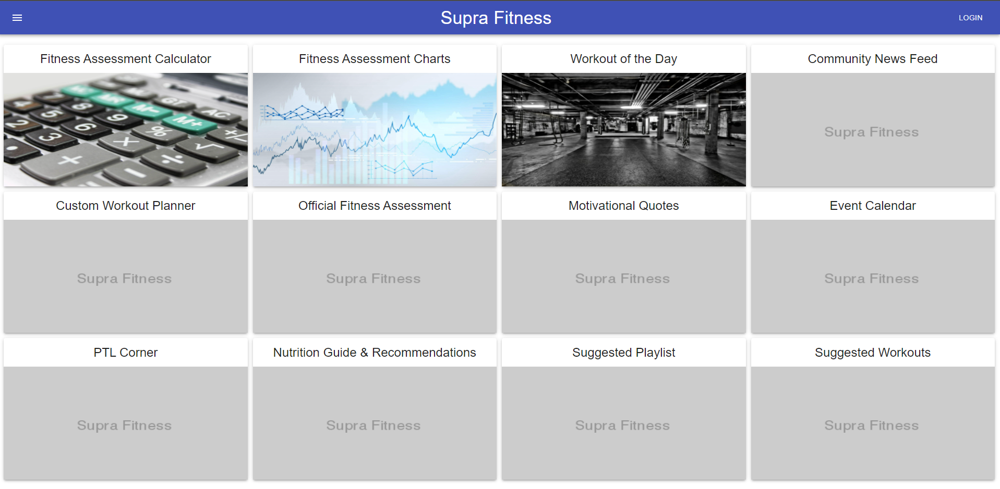
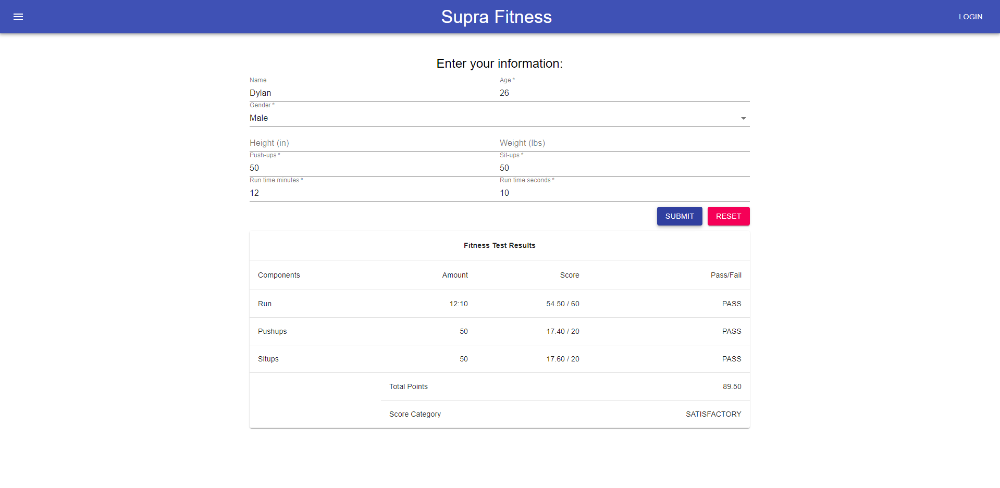

# Supra Fitness

### The ultimate fitness app for Airman and Guardians alike



## Contents

1. Modules
2. API
3. Development
4. About

## Modules

### Fitness Assessment Calculator

A form to calculate any Air Force/Space Force PT score for all ages and genders. Up to date with the latest PT charts as of May 2021. 

To-do:

- [x] Fill database with data for all ages and genders
- [x] Add material-ui styling
- [ ] Stress test and ensure validity of data being supplied



## API

### Fitness Scores API 

`GET` `\scores`

Returns an object with all scores for both sexes and all age brackets. Age brackets are categorized by a numeric identifier as follows: 

* **24**: 24 years of age and below
* **29**: 25 - 29 years of age
* **34**: 30 - 34 years of age
* **39**: 35 - 39 years of age
* **44**: 40 - 44 years of age
* **49**: 45 - 49 years of age
* **54**: 50 - 54 years of age
* **59**: 55 - 59 years of age
* **60**: 60 years of age and above

Also note that run times are stored in seconds. 

Example: 
```
{
    "male": {
        "24": {
            "run_scores": [
                {
                    "run": 552,
                    "run_points": "60.00"
                },
                {
                    "run": 574,
                    "run_points": "59.50"
                },
                {
                    "run": 585,
                    "run_points": "59.00"
                },
                {
                    "run": 598,
                    "run_points": "58.50"
                },
                {
                    "run": 610,
                    "run_points": "58.00"
                },
                {
                    "run": 623,
                    "run_points": "57.50"
                },
                {
                    "run": 637,
                    "run_points": "57.00"
                },
                {
                    "run": 651,
                    "run_points": "56.50"
                },
                {
                    "run": 666,
                    "run_points": "56.00"
                },
                {
                    "run": 682,
                    "run_points": "55.50"
                },
                {
                    "run": 698,
                    "run_points": "55.00"
                },
                {
                    "run": 716,
                    "run_points": "54.50"
                },
                {
                    "run": 734,
                    "run_points": "54.00"
                },
                {
                    "run": 753,
                    "run_points": "53.50"
                },
                {
                    "run": 773,
                    "run_points": "52.00"
                },
                {
                    "run": 794,
                    "run_points": "50.50"
                },
                {
                    "run": 816,
                    "run_points": "49.00"
                },
                {
                    "run": 840,
                    "run_points": "46.50"
                },
                {
                    "run": 865,
                    "run_points": "44.00"
                },
                {
                    "run": 892,
                    "run_points": "41.00"
                },
                {
                    "run": 920,
                    "run_points": "38.00"
                },
                {
                    "run": 950,
                    "run_points": "35.00"
                }
            ],
            "pushups_scores": [
                {
                    "pushups": 67,
                    "pushups_points": "20.00"
                },
                {
                    "pushups": 66,
                    "pushups_points": "19.80"
                },
                {
                    "pushups": 65,
                    "pushups_points": "19.60"
                },
                {
                    "pushups": 64,
                    "pushups_points": "19.40"
                },
                {
                    "pushups": 63,
                    "pushups_points": "19.20"
                },
                {
                    "pushups": 62,
                    "pushups_points": "19.00"
                },
                {
                    "pushups": 61,
                    "pushups_points": "18.80"
                },
                {
                    "pushups": 60,
                    "pushups_points": "18.60"
                },
                {
                    "pushups": 59,
                    "pushups_points": "18.40"
                },
                {
                    "pushups": 58,
                    "pushups_points": "18.20"
                },
                {
                    "pushups": 57,
                    "pushups_points": "18.00"
                },
                {
                    "pushups": 56,
                    "pushups_points": "17.80"
                },
                {
                    "pushups": 55,
                    "pushups_points": "17.70"
                },
                {
                    "pushups": 54,
                    "pushups_points": "17.60"
                },
                {
                    "pushups": 53,
                    "pushups_points": "17.40"
                },
                {
                    "pushups": 52,
                    "pushups_points": "17.20"
                },
                {
                    "pushups": 51,
                    "pushups_points": "17.00"
                },
                {
                    "pushups": 50,
                    "pushups_points": "16.80"
                },
                {
                    "pushups": 49,
                    "pushups_points": "16.60"
                },
                {
                    "pushups": 48,
                    "pushups_points": "16.20"
                },
                {
                    "pushups": 47,
                    "pushups_points": "16.00"
                },
                {
                    "pushups": 46,
                    "pushups_points": "15.60"
                },
                {
                    "pushups": 45,
                    "pushups_points": "15.40"
                },
                {
                    "pushups": 44,
                    "pushups_points": "15.00"
                },
                {
                    "pushups": 43,
                    "pushups_points": "14.60"
                },
                {
                    "pushups": 42,
                    "pushups_points": "14.40"
                },
                {
                    "pushups": 41,
                    "pushups_points": "14.00"
                },
                {
                    "pushups": 40,
                    "pushups_points": "13.60"
                },
                {
                    "pushups": 39,
                    "pushups_points": "13.00"
                },
                {
                    "pushups": 38,
                    "pushups_points": "12.60"
                },
                {
                    "pushups": 37,
                    "pushups_points": "12.00"
                },
                {
                    "pushups": 36,
                    "pushups_points": "11.60"
                },
                {
                    "pushups": 35,
                    "pushups_points": "11.00"
                },
                {
                    "pushups": 34,
                    "pushups_points": "10.60"
                },
                {
                    "pushups": 33,
                    "pushups_points": "10.00"
                },
                {
                    "pushups": 32,
                    "pushups_points": "7.00"
                },
                {
                    "pushups": 31,
                    "pushups_points": "4.00"
                },
                {
                    "pushups": 30,
                    "pushups_points": "1.00"
                }
            ],
            "situps_scores": [
                {
                    "situps": 58,
                    "situps_points": "20.00"
                },
                {
                    "situps": 57,
                    "situps_points": "19.70"
                },
                {
                    "situps": 56,
                    "situps_points": "19.40"
                },
                {
                    "situps": 55,
                    "situps_points": "19.00"
                },
                {
                    "situps": 54,
                    "situps_points": "18.80"
                },
                {
                    "situps": 53,
                    "situps_points": "18.40"
                },
                {
                    "situps": 52,
                    "situps_points": "18.00"
                },
                {
                    "situps": 51,
                    "situps_points": "17.60"
                },
                {
                    "situps": 50,
                    "situps_points": "17.40"
                },
                {
                    "situps": 49,
                    "situps_points": "17.00"
                },
                {
                    "situps": 48,
                    "situps_points": "16.60"
                },
                {
                    "situps": 47,
                    "situps_points": "16.00"
                },
                {
                    "situps": 46,
                    "situps_points": "15.00"
                },
                {
                    "situps": 45,
                    "situps_points": "14.00"
                },
                {
                    "situps": 44,
                    "situps_points": "13.00"
                },
                {
                    "situps": 43,
                    "situps_points": "12.60"
                },
                {
                    "situps": 42,
                    "situps_points": "12.00"
                },
                {
                    "situps": 41,
                    "situps_points": "9.00"
                },
                {
                    "situps": 40,
                    "situps_points": "6.00"
                },
                {
                    "situps": 39,
                    "situps_points": "3.00"
                }
            ]
        },
        "29": {
            run_scores: [ ... ],
            situps_scores: [ ... ],
            pushups_scores: [ ... ]

        },
        "34": { ... },
        "39": { ... },
        "44": { ... },
        "49": { ... },
        "54": { ... },
        "59": { ... },
        "60": { ... }
    },
    "female": {
        "24": { ... },
        "29": { ... },
        "34": { ... },
        "39": { ... },
        "44": { ... },
        "49": { ... },
        "54": { ... },
        "59": { ... },
        "60": { ... }
    }
}
```
---
`GET` `\scores` with `category`, `gender`, or `age` query

Use `category` to filter out all but one category.

Use `age` to filter out all but one age bracket. 
*NOTE*: You can type in any age. If you type in 26, for example, the api will know to return 29 (the 25-29 age bracket)

Use `gender` to filter one of the sexes. 

All three of these queries can be used interchangebly.
The structure of the object returned will not change.

For example: `\scores?gender=female`

```
{
    "female": {
        "24": { ... },
        "29": { ... },
        "34": { ... },
        "39": { ... },
        "44": { ... },
        "49": { ... },
        "54": { ... },
        "59": { ... },
        "60": { ... }
    }
}
```
---
`GET` `\scores` with `raw` query

Use `raw` to get a simplified object. 
*NOTE*: This will only work if you have at least `gender` and `age` specified. 

If you have only the `gender` and `age` specified, you will be returned a simplified object: 

For example: `\scores?gender=male&&age=24&&raw=true`

```
{
    "run_scores": [{ 
        "run": 552,
        "run_points": "60.0"
    } ... ],
    "pushups_scores": [ ... ],
    "situps_scores": [ ... ]
}
```

If `category` is also specified, you will receive an array instead.

For example: `\scores?gender=male&&age=24&&category=true&&raw=true`

```
[
    {
        "run": 552,
        "run_points": "60.00"
    },
    {
        "run": 574,
        "run_points": "59.50"
    },
    {
        "run": 585,
        "run_points": "59.00"
    } 
    ...
]
```

## Development

### Tech Stack

### Instructions

1. Fork and clone this repository
2. Make sure **docker** and **wsl** are up and running
3. `cd` into the local remote's root folder and run `npm run docker:build`
4. In the root folder, run `npm run docker:up`
5. Type `http://localhost:3000` in your browser to view the website
6. When done, `cd` into the local remote's root folder and run `npm run docker:down`

## About 

This repository was created as the 2nd project in the Supra Coders Cohort in partnership with Galvanize. 

### Contributors

- barrazaedier
- mangits
- SamCrouch
- khalilcampbell7

